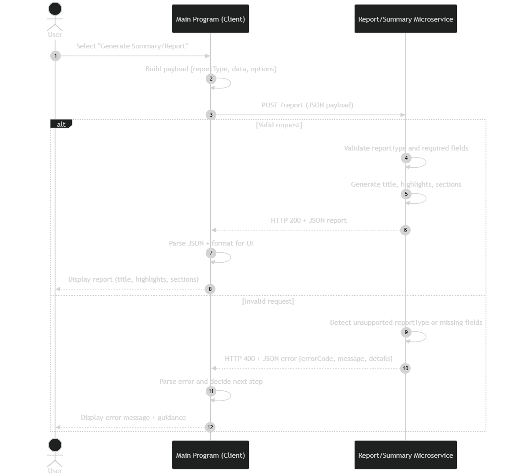

# Reporting & Summary Generator Microservice

## What this microservice does
The Reporting & Summary Generator microservice converts structured input data into a user-friendly **report** that a Main Program can display to users.

It is designed to support multiple different Main Programs by accepting a `reportType` and a `data` payload, then returning a structured report that includes:
- A `title`
- A list of `sections` (readable report content)
- A list of `highlights` (key takeaways)

This microservice is **headless** (no UI) and is intended to be called programmatically by other programs.

---

## How to run the microservice (local)
First run this: 
```bash
python -m pip install -r requirements.txt
```

Second run this: 
```bash
python app.py
```
Third, run this:
```bash
python test_client.py
```

## How to programmatically REQUEST data (Communication Contract)
### Endpoint

* Method: `POST`
* Path: `/report`
* Content-Type: `application/json`

### Required request parameters (JSON body)

* `reportType` (string, required)

    Supported values:
    * "deadlines"
    * "portfolio"
    * "iotStatus"
    * "gameRunSummary"

* `data` (object, required)
Structured input data required to generate the report.
(The schema depends on `reportType`.)

* `options` (object, optional)

    Example options:
    * maxItems (int)
    * includeDetails (bool)
    * timezone (string)

### Example request (Python)
```python
import requests

payload = {
  "reportType": "deadlines",
  "data": {
    "studentName": "Mark",
    "assignments": [
      {"course": "CS 361", "title": "Assignment 7", "dueDate": "2026-02-23", "status": "In Progress"},
      {"course": "CS 381", "title": "HW5", "dueDate": "2026-02-25", "status": "Not Started"}
    ]
  },
  "options": {"maxItems": 10, "includeDetails": False}
}

resp = requests.post("http://127.0.0.1:5000/report", json=payload, timeout=2)
print(resp.status_code, resp.json())
```

## How to programmatically RECEIVE data (Communication Contract)

### Response Type
* JSON(`application/json`)

### Success response (HTTP 200)
On success, the microservice returns:
* `title` (string)
* `highlights` (list of strings)
* `sections` (list of objects)
* `generatedAt` (string timestamp)

#### Example success response

```JSON
{
  "title": "Upcoming Deadlines Summary",
  "highlights": [
    "Next due: CS 361 Assignment 7 (2026-02-23)",
    "2 assignments are due within 7 days",
    "1 assignment is currently In Progress"
  ],
  "sections": [
    {
      "header": "Upcoming Assignments",
      "items": [
        "CS 381 — HW5 — Due 2026-02-25 — Not Started",
        "CS 361 — Assignment 7 — Due 2026-02-23 — In Progress"
      ]
    }
  ],
  "generatedAt": "2026-02-23T20:10:00Z"
}
```

### Error response (HTTP 400)
If the request is invalid (unsupported report type, missing fields, etc.), the microservice returns:
* `errorCode` (string)
* `message` (string)
* `details` (object, optional)

#### Example error response
```JSON
{
  "errorCode": "INVALID_REQUEST",
  "message": "Unsupported reportType: 'gradesSnapshot'. Supported types: deadlines, portfolio, iotStatus, gameRunSummary.",
  "details": {
    "reportType": "gradesSnapshot"
  }
}
```

### Client-side parsing example (Python)

```python
import requests

resp = requests.post("http://127.0.0.1:5000/report", json={"reportType":"deadlines","data":{}}, timeout=2)

if resp.status_code == 200:
    report = resp.json()
    title = report["title"]
    highlights = report["highlights"]
    sections = report["sections"]
else:
    err = resp.json()
    print("Error:", err["message"])
```

## UML Sequence Diagram (Request + Response)
This diagram shows how a Main Program requests a report and receives the report back.
It also shows the validation path when an invalid request is sent.

